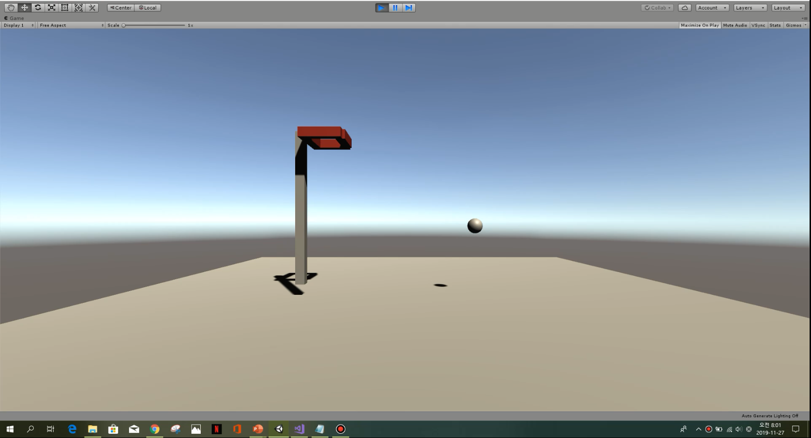

# 이력서 (RESUME)
## 소개
----------------------------


- 이름 : 선민구

- 군필여부 : 미필

- Email : tjsalsrn6@naver.com

- GitHub : github.com/Sun38

```
맡은 일은 어떠한 일이라도 최선을 다하고자 합니다.
```

## 취미 및 특기 사항
-------------------------------
- 취미
    + 기타 연주
    + 노래 부르기
    + 헬스
    + 농구

- 특기 사항
    + 게임 제작
    + 역사 지식

# 개인 경력
- CU 편의점 아르바이트 근무 (2019.02 ~ 2019.08)
- 베이커리 아르바이트 근무 (2018.07 ~ 2018.08)
- 뷔페 아르바이트 근무 (2018.02 ~ 2018. 05)
- 한림대학교 소프트웨어융학대학 교학팀 근로장학생 근무 (2019.12 ~ 2020.02)

## 단체경력
---------------------------------------
- 소프트웨어융합대학 학술동아리 씨애랑 (2018.03 ~ 2018.08)

- 중앙동아리 락밴드 CODA (2018.03 ~ 2018.12)

- 네이버 커넥트재단 부스트 코딩뉴비 챌린지 2020 SUMMER: CS50 (2020.07 ~ 2020.08)

- 중앙동아리 JDM 찬양 연주 기타 담당 (2018.03 ~ 2018.12)

## 학력
------------------------------------------
- 동국대학교사범대학부속고등학교 졸업 (2015.03 ~ 2018.02)

- 한림대학교 소프트웨어융합대학 빅데이터전공 3학년 재학 (2018.02 ~)
    + JAVA 프로그래밍
    + C 프로그래밍
    + C++ 프로그래밍
    + 파이썬과학프로그래밍기초
    + 자료구조
    + 알고리즘
    + 데이터베이스
    + 컴퓨터구조
    + VR/AR 게임제작기초
    + 데이터시각화
    + 운영체제
    + 윈도우프로그래밍
    + 프로그래밍어론
    + 소프트웨어개론
    + ...
## 보유자격증
- 자동차운전면허증 2종 보통 (2018.02.07)
## 사용 기술
---------------------------
- JAVA
- C
- C++
- C#
- Unity Engine
- Linux
- Python
- R

## 개인 프로젝트
----------------------------
- Python 게임 만들기
    + 소개 : Python의 turtle 모듈을 사용하여 간단한 게임 만들기
    + 관련기술 : Python
    + 라이브러리 : random, turtle, time, sys
    
```python
import random                         
import turtle as t
import time
import sys


#변수 초기 설정
life=1
bspd=1
tspd=3
score=0
tablue=2
tbblue=2

#적 거북이 설정
tb=t.Turtle()
tb.shape("turtle")
tb.color("red")
tb.speed(0)
tb.up()
tb.goto(0,200)

#먹이 1 설정
tta=t.Turtle()
tta.shape("square")
tta.color("brown")
tta.turtlesize(0.5)
tta.speed(0)
tta.up()
tta.goto(random.randint(-210,210),random.randint(-210,210))

#먹이 2 설정
ttb=t.Turtle()
ttb.shape("square")
ttb.color("brown")
ttb.turtlesize(0.5)
ttb.speed(0)
ttb.up()
ttb.goto(random.randint(-210,210),random.randint(-210,210))

#플레이어 거북이 설정
t.shape("turtle")
t.speed(0)

#동선을 그리지 않음
t.up()

#방향 함수 설정
def right():
    t.setheading(0)
def up():
    t.setheading(90)
def left():
    t.setheading(180)
def down():
    t.setheading(270)
    
#화살표 키를 누르면 고개를 돌림
t.onkeypress(right,"Right")
t.onkeypress(up,"Up")
t.onkeypress(left,"Left")
t.onkeypress(down,"Down")

#
t.setup(500,500)
t.listen()
t.bgcolor("white")

#게임 설명
print("[ Turtle Survival -- 게임 규칙 ]")
print("1. 키보드의 방향키를 통해 움직입니다.")
print("2. 맵에 무작위로 놓여있는 작은 사각형(먹이)을 먹습니다.")
print("3. 빨간거북이를 피해 최대한 오래 살아남습니다.")
print("4. 빨간거북이와 부딫히면 게임이 끝나고 결과창이 뜨게됩니다.")
print("Tip: 가끔씩 파란색 먹이가 나타나는데, 점수를 2배로 줍니다.\n")


#플레이타임 측정 시작
time_a=time.time()

#게임 실행
while life==1:

    #적 거북이와 닿으면 게임 오버
    if t.distance(tb)<15:
        life=0  

    #프로그램 창 타이플 설정
    scorestr=str(score)
    gametitle="[ Tutrle Survival ] 현재 모은 먹이 수: "+scorestr+"개"
    t.title(gametitle)

    #맵 밖으로 탈출 방지
    xpos=t.xcor()
    ypos=t.ycor()
    if xpos>250:
        t.setx(230)
    if xpos<-250:
        t.setx(-230)
    if ypos>230:
        t.sety(230)
    if ypos<-230:
        t.sety(-230) 

    #적 거북이 이동 설정
    w=tb.towards(t.pos())
    tb.setheading(w)
    t.fd(tspd)
    tb.fd(bspd) 
    nspd=int(tspd)

    #먹이 1를 먹었을 때
    if t.distance(tta)<20:
        
        #랜덤한 위치로 이동시킴
        tax=random.randint(-210,210)
        tay=random.randint(-210,210)
        tta.goto(tax,tay)
        
        #먹이가 파란색일 때는 점수 2점 획득, 아니면 1
        if tablue==1:
            score=score+2
        else:
            score=score+1
            
        #다음 번에 랜덤으로 먹이를 파란색 혹은 갈색으로 결정
        tablue=random.randint(1,13-nspd)
        if tablue==1:
            tta.color(0,0,1)
        else:
            tta.color("brown")

    #먹이 2도 동일           
    if t.distance(ttb)<20:
        tbx=random.randint(-210,210)
        tby=random.randint(-210,210)
        ttb.goto(tbx,tby)
        if tbblue==1:
            score=score+2
        else:
            score=score+1
            tbblue=random.randint(1,13-nspd)
        if tbblue==1:
            ttb.color(0,0,1)
        else:
            ttb.color("brown")
            
    #플레이어 거북이 속도증가. 최대 속도 9
    if tspd<=9:
        tspd=tspd+0.001
        
    #적 거북이 속도증가. 최대속도 8.35
    if bspd<8.35:
        bspd=bspd+0.0011

    #속도가 빨라질 수록(시간이 지날수록) 배경이 어두워짐
    if nspd==4:
        t.bgcolor(0.85,0.85,0.85)
    if nspd==5:
        t.bgcolor(0.7,0.7,0.7)
    if nspd==6:
        t.bgcolor(0.5,0.5,0.5)
    if nspd==7:
        t.bgcolor(0.4,0.4,0.4)
    if nspd==8:
        t.bgcolor(0.25,0.25,0.25)

#게임 종료
        
#플레이타임 기록
time_b=time.time()
playtime=time_b-time_a

#오브젝트 숨김
t.ht()
tta.ht()
ttb.ht()
tb.ht()
t.bgcolor(1,1,1)

#결과 화면 출력
t.title("[ Tutrle Survival ] 게임이 종료되었습니다.")
print("\n――――――――――――< 게임 종료 >――――――――――――\n")
if score>=0:
    print("[ Result ] 당신은 총 ",score," 개의 먹이를 먹었습니다.")
gm=0
gs=0
if playtime>3600:
    print("[ Result ] 당신은... 도대체 게임을 얼마나 오랫동안 한 거죠?\n")
else:
    if playtime//60>0:
        gm=int(playtime//60)
        gs=int(playtime%60)
    if playtime//60==0:
        gs=int(playtime)
    print("[ Result ] 당신은", gm," 분 ",gs," 초 동안 생존하였습니다.\n")
finalscore=int(score*40+playtime*10)
print("[ Result ] 총 점수:", finalscore)
rank="F"
if finalscore>800:
    rank="E"
if finalscore>1500:
    rank="D"
if finalscore>3000:
    rank="C"
if finalscore>5000:
    rank="B"
if finalscore>10000:
    rank="A"
if finalscore>25000:
    rank="S"
if finalscore>50000:
    rank="SS"
if finalscore>999999:
    rank="SSS"

print("\n[ Result ] 랭크 ▶ ",rank," Rank")
print("\n          *엔터를 누르면 게임을 종료합니다.")
print("―――――――――――――――――――――――――――――――")
input()
sys.exit()
```

- Unity Engine 게임 만들기
    + 소개 : Unity Engine을 활용하여 간단한 농구 게임 만들기
    + 관련기술 : C#, Unity Engine 활용 능력



- 해외 경험


